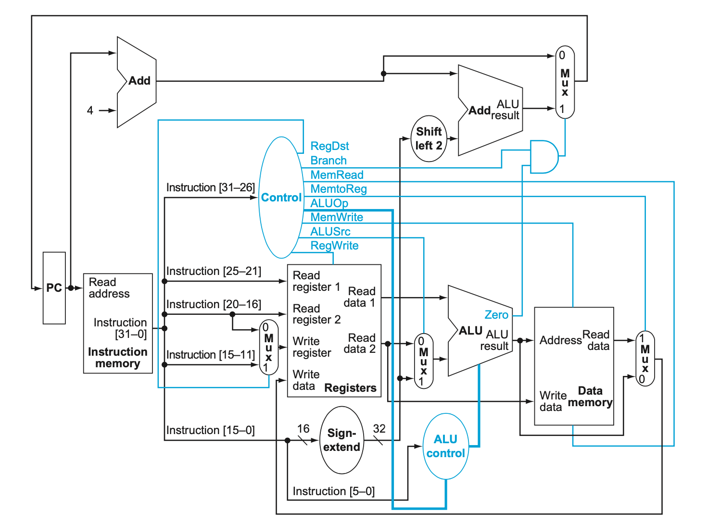
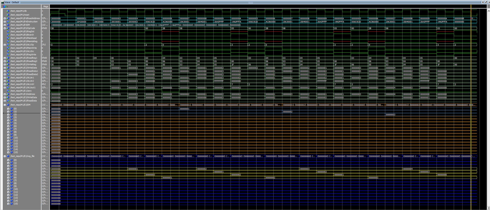

# MIPS Processor in VHDL (Single Cycle)
A VHDL implementation of the MIPS Processor with :  
* 16 Registers of 32-bit (Register File)  
* 16 Memory Slots of 32-bit (Data Memory)  
* simple operations in ALU (Addtition, Subtraction, Branch etc.)  
* Type R and Type I operations  
* PC increases by 1  
*  Inital Address is 0x00000000  
  
## Program for Execution (Instruction Memory):
addi $2, $2, 0  
addi $2, $4, 0  
addi $3, $0, 1  
addi $5, $0, 3  
L1: add $6, $3, $0  
sw $6, 0($4)  
addi $3, $3, 1  
addi $4, $4, 1  
addi $5, $5, -1  
bne $5,$0,L1  
## Wave in Modelsim
  
